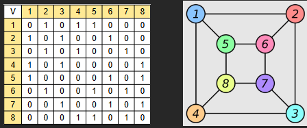
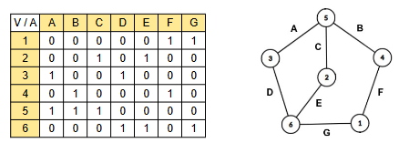
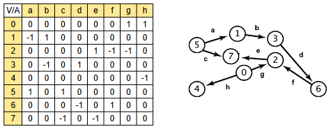

# Matriz de Adjacência de Grafos

Repositório dedicado à implementação de grafos e dígrafos utilizando matriz de adjacência. Ela incluí documentação, exemplos e código da implementação

## Sumário
graph-adjacency-matrix-implementation
├── src/
│   └── grafo.py
├── examples/
│   └── 
└── README.md

## Conceitos

Um **Grafo** é uma estruta de dados compostas por: **Vértices**(nós) e **Areas**(conexões).
```txt
G = (V, E)
```

Um **dígrafo** (grafo direcionado) possui arestas com direção.
Exemplo:
```txt
A -> B
B -> C
C -> A
```
>[!NOTE]  
> Em caso de dúvida, consulte o [seguinte repositório](https://github.com/Mateus-Alencar/EstruturaDeDados/blob/main/DOCS/grafos.md).

### Matriz de Adjacência

A matriz de adjacência é uma forma de representar grafos utilizando uma matriz quadrada.

> Se um grafo possui N vértices, a matriz terá dimensão: `N x N`  

Grafo:


`1 → existe aresta / 0 → não existe aresta`

### Matriz de incidência
Grafo

Dígrafo
